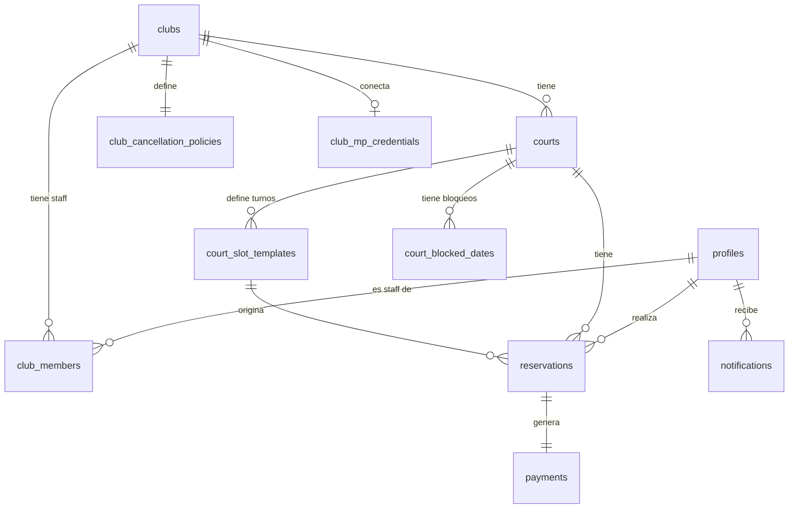

# Database Schema — Shadow Clubs

> Motor: PostgreSQL via Supabase  
> Autenticación: Supabase Auth (`auth.users`)  
> Almacenamiento: Supabase Storage (imágenes de clubes y canchas)  
> País inicial: Argentina (moneda ARS)

---

## Extensiones requeridas

```sql
CREATE EXTENSION IF NOT EXISTS "uuid-ossp";   -- UUIDs
CREATE EXTENSION IF NOT EXISTS "unaccent";    -- búsqueda sin acentos
```

> **PostGIS** queda pendiente para la fase de búsqueda por geolocalización. Por ahora se usa `lat/lng` float y distancia calculada en la aplicación.

---

## Enums

```sql
-- Rol a nivel de plataforma (no confundir con roles de club)
CREATE TYPE platform_role AS ENUM ('admin', 'user');

-- Rol dentro de un club específico
CREATE TYPE club_role AS ENUM ('club_owner', 'club_administrator');

-- Deportes soportados
CREATE TYPE sport_type AS ENUM (
  'football_5',
  'football_7',
  'football_11',
  'tennis',
  'paddle',
  'basketball',
  'volleyball',
  'futsal',
  'rugby',
  'hockey',
  'other'
);

-- Tipo de superficie de la cancha
CREATE TYPE surface_type AS ENUM (
  'natural_grass',
  'synthetic_grass',
  'cement',
  'clay',
  'parquet',
  'rubber',
  'other'
);

-- Estado del ciclo de vida de una reserva
CREATE TYPE reservation_status AS ENUM (
  'pending_payment',   -- creada, esperando que MP confirme el pago
  'confirmed',         -- pago aprobado
  'cancelled',         -- cancelada (por usuario o staff)
  'completed',         -- turno ya ocurrió
  'no_show'            -- el usuario no apareció
);

-- Estado del pago en Mercado Pago
CREATE TYPE payment_status AS ENUM (
  'pending',
  'approved',
  'in_process',
  'rejected',
  'refunded',
  'cancelled',
  'charged_back'
);

-- Tipo de reembolso en política de cancelación
CREATE TYPE refund_type AS ENUM (
  'full',       -- reembolso completo
  'partial',    -- reembolso parcial (porcentaje configurable)
  'none'        -- sin reembolso
);

-- Canal de notificación
CREATE TYPE notification_channel AS ENUM ('email', 'push', 'whatsapp');

-- Tipo de evento de notificación
CREATE TYPE notification_type AS ENUM (
  'reservation_confirmed',
  'reservation_cancelled',
  'reservation_reminder',   -- X horas antes del turno
  'payment_approved',
  'payment_rejected',
  'payment_refunded'
);
```

---

## Tablas

### `profiles`

Extiende `auth.users` de Supabase. Se crea automáticamente vía trigger al registrarse un usuario.

```sql
CREATE TABLE profiles (
  id              UUID PRIMARY KEY REFERENCES auth.users(id) ON DELETE CASCADE,
  first_name      TEXT NOT NULL,
  last_name       TEXT NOT NULL,
  avatar_url      TEXT,
  phone           TEXT,
  platform_role   platform_role NOT NULL DEFAULT 'user',
  created_at      TIMESTAMPTZ NOT NULL DEFAULT NOW(),
  updated_at      TIMESTAMPTZ NOT NULL DEFAULT NOW()
);
```

| Columna | Tipo | Notas |
|---------|------|-------|
| `id` | uuid | PK, FK → `auth.users.id` |
| `first_name` | text | nombre |
| `last_name` | text | apellido |
| `avatar_url` | text | URL de Supabase Storage |
| `phone` | text | opcional, útil para WhatsApp |
| `platform_role` | enum | `admin` solo para el superadmin de la plataforma |
| `created_at` | timestamptz | — |
| `updated_at` | timestamptz | actualizado por trigger |

---

### `clubs`

Cada complejo deportivo. Un `club_owner` puede tener uno o más clubs.

```sql
CREATE TABLE clubs (
  id              UUID PRIMARY KEY DEFAULT uuid_generate_v4(),
  name            TEXT NOT NULL,
  slug            TEXT NOT NULL UNIQUE,         -- para URLs amigables
  description     TEXT,
  logo_url        TEXT,
  cover_url       TEXT,
  address         TEXT NOT NULL,
  city            TEXT NOT NULL,
  province        TEXT NOT NULL,
  country         TEXT NOT NULL DEFAULT 'AR',
  lat             NUMERIC(10, 7),               -- latitud
  lng             NUMERIC(10, 7),               -- longitud
  phone           TEXT,
  email           TEXT,
  website         TEXT,
  is_active       BOOLEAN NOT NULL DEFAULT TRUE,
  created_at      TIMESTAMPTZ NOT NULL DEFAULT NOW(),
  updated_at      TIMESTAMPTZ NOT NULL DEFAULT NOW()
);
```

| Columna | Tipo | Notas |
|---------|------|-------|
| `id` | uuid | PK |
| `name` | text | nombre público del club |
| `slug` | text | ej: `complejo-el-gol`, generado al crear el club |
| `description` | text | descripción larga |
| `logo_url` | text | Supabase Storage |
| `cover_url` | text | imagen de portada |
| `address` | text | dirección completa |
| `city` | text | — |
| `province` | text | ej: `Buenos Aires`, `Córdoba` |
| `country` | text | ISO 3166-1 alpha-2 |
| `lat` / `lng` | numeric | precisión suficiente para ~1m |
| `phone` | text | teléfono de contacto del club |
| `email` | text | email de contacto |
| `website` | text | opcional |
| `is_active` | boolean | soft delete / baja temporal |

> **Nota**: `lat/lng` se usarán para "clubes cercanos" en la app de usuarios. En fase 2 se migra a columna `location geography(Point, 4326)` con PostGIS para queries de distancia eficientes.

---

### `club_members`

Relaciona usuarios con clubs y define su rol dentro de ese club. Un usuario puede ser staff de múltiples clubs.

```sql
CREATE TABLE club_members (
  id            UUID PRIMARY KEY DEFAULT uuid_generate_v4(),
  club_id       UUID NOT NULL REFERENCES clubs(id) ON DELETE CASCADE,
  user_id       UUID NOT NULL REFERENCES profiles(id) ON DELETE CASCADE,
  role          club_role NOT NULL,
  invited_by    UUID REFERENCES profiles(id) ON DELETE SET NULL,
  is_active     BOOLEAN NOT NULL DEFAULT TRUE,
  created_at    TIMESTAMPTZ NOT NULL DEFAULT NOW(),

  UNIQUE (club_id, user_id)
);
```

| Columna | Tipo | Notas |
|---------|------|-------|
| `id` | uuid | PK |
| `club_id` | uuid | FK → clubs |
| `user_id` | uuid | FK → profiles |
| `role` | enum | `club_owner` o `club_administrator` |
| `invited_by` | uuid | quién invitó al miembro |
| `is_active` | boolean | permite revocar acceso sin borrar historial |

> **Regla de negocio**: solo puede haber un `club_owner` activo por club. Validar a nivel de aplicación y/o trigger.

---

### `courts`

Canchas de un club. Cada cancha tiene un único deporte.

```sql
CREATE TABLE courts (
  id              UUID PRIMARY KEY DEFAULT uuid_generate_v4(),
  club_id         UUID NOT NULL REFERENCES clubs(id) ON DELETE CASCADE,
  name            TEXT NOT NULL,                -- ej: "Cancha 1", "Cancha Principal"
  sport_type      sport_type NOT NULL,
  description     TEXT,
  surface_type    surface_type NOT NULL,
  is_indoor       BOOLEAN NOT NULL DEFAULT FALSE,
  capacity        SMALLINT,                     -- cantidad de jugadores
  photo_urls      TEXT[] NOT NULL DEFAULT '{}', -- array de URLs en Storage
  is_active       BOOLEAN NOT NULL DEFAULT TRUE,
  created_at      TIMESTAMPTZ NOT NULL DEFAULT NOW(),
  updated_at      TIMESTAMPTZ NOT NULL DEFAULT NOW()
);
```

| Columna | Tipo | Notas |
|---------|------|-------|
| `id` | uuid | PK |
| `club_id` | uuid | FK → clubs |
| `name` | text | nombre interno de la cancha |
| `sport_type` | enum | deporte fijo, una cancha = un deporte |
| `description` | text | detalles adicionales |
| `surface_type` | enum | tipo de superficie |
| `is_indoor` | boolean | cubierta o descubierta |
| `capacity` | smallint | cantidad de jugadores (ej: 10 para fútbol 5) |
| `photo_urls` | text[] | array de URLs de Supabase Storage |
| `is_active` | boolean | baja lógica |

---

### `court_slot_templates`

Define los turnos recurrentes de una cancha por día de la semana. Es la "plantilla" de disponibilidad semanal.

```sql
CREATE TABLE court_slot_templates (
  id                  UUID PRIMARY KEY DEFAULT uuid_generate_v4(),
  court_id            UUID NOT NULL REFERENCES courts(id) ON DELETE CASCADE,
  day_of_week         SMALLINT NOT NULL CHECK (day_of_week BETWEEN 0 AND 6), -- 0=Domingo
  start_time          TIME NOT NULL,
  end_time            TIME NOT NULL,
  duration_minutes    SMALLINT NOT NULL DEFAULT 60,
  price               NUMERIC(10, 2) NOT NULL,
  is_active           BOOLEAN NOT NULL DEFAULT TRUE,
  created_at          TIMESTAMPTZ NOT NULL DEFAULT NOW(),
  updated_at          TIMESTAMPTZ NOT NULL DEFAULT NOW(),

  CHECK (end_time > start_time),
  UNIQUE (court_id, day_of_week, start_time)
);
```

| Columna | Tipo | Notas |
|---------|------|-------|
| `id` | uuid | PK |
| `court_id` | uuid | FK → courts |
| `day_of_week` | smallint | 0=domingo, 1=lunes … 6=sábado |
| `start_time` | time | hora de inicio del turno |
| `end_time` | time | hora de fin del turno |
| `duration_minutes` | smallint | duración en minutos (ej: 60, 90) |
| `price` | numeric | precio en ARS del turno (lo que cobra el club) |
| `is_active` | boolean | deshabilitar un turno sin borrarlo |

> **Cómo se usa**: cuando un usuario quiere ver disponibilidad para una fecha, se buscan los `court_slot_templates` del `day_of_week` correspondiente y se cruzan contra las reservas existentes para esa fecha.

---

### `court_blocked_dates`

Fechas o franjas específicas en las que una cancha no está disponible (mantenimiento, feriado, evento especial).

```sql
CREATE TABLE court_blocked_dates (
  id          UUID PRIMARY KEY DEFAULT uuid_generate_v4(),
  court_id    UUID NOT NULL REFERENCES courts(id) ON DELETE CASCADE,
  date        DATE NOT NULL,
  start_time  TIME,           -- NULL significa todo el día bloqueado
  end_time    TIME,
  reason      TEXT,
  created_by  UUID REFERENCES profiles(id) ON DELETE SET NULL,
  created_at  TIMESTAMPTZ NOT NULL DEFAULT NOW()
);
```

| Columna | Tipo | Notas |
|---------|------|-------|
| `id` | uuid | PK |
| `court_id` | uuid | FK → courts |
| `date` | date | fecha específica bloqueada |
| `start_time` / `end_time` | time | rango bloqueado; NULL = todo el día |
| `reason` | text | motivo interno (mantenimiento, etc.) |
| `created_by` | uuid | staff que lo registró |

---

### `reservations`

Corazón del sistema. Cada reserva es un turno de un usuario en una cancha en una fecha.

```sql
CREATE TABLE reservations (
  id                    UUID PRIMARY KEY DEFAULT uuid_generate_v4(),
  court_id              UUID NOT NULL REFERENCES courts(id) ON DELETE RESTRICT,
  slot_template_id      UUID NOT NULL REFERENCES court_slot_templates(id) ON DELETE RESTRICT,
  user_id               UUID NOT NULL REFERENCES profiles(id) ON DELETE RESTRICT,
  date                  DATE NOT NULL,
  start_time            TIME NOT NULL,     -- denormalizado desde slot_template
  end_time              TIME NOT NULL,     -- denormalizado desde slot_template
  status                reservation_status NOT NULL DEFAULT 'pending_payment',
  total_amount          NUMERIC(10, 2) NOT NULL,   -- lo que pagó el usuario (precio + comisión)
  court_amount          NUMERIC(10, 2) NOT NULL,   -- lo que recibe el club
  platform_fee          NUMERIC(10, 2) NOT NULL,   -- comisión de la plataforma
  cancellation_reason   TEXT,
  cancelled_at          TIMESTAMPTZ,
  cancelled_by          UUID REFERENCES profiles(id) ON DELETE SET NULL,
  created_at            TIMESTAMPTZ NOT NULL DEFAULT NOW(),
  updated_at            TIMESTAMPTZ NOT NULL DEFAULT NOW()
);

-- Una cancha no puede tener dos reservas activas para el mismo turno en la misma fecha
CREATE UNIQUE INDEX reservations_no_overlap_idx
  ON reservations (court_id, date, start_time)
  WHERE status NOT IN ('cancelled');
```

| Columna | Tipo | Notas |
|---------|------|-------|
| `id` | uuid | PK |
| `court_id` | uuid | FK → courts |
| `slot_template_id` | uuid | FK → court_slot_templates |
| `user_id` | uuid | quien hizo la reserva |
| `date` | date | fecha específica del turno |
| `start_time` / `end_time` | time | denormalizados para queries rápidas de disponibilidad |
| `status` | enum | ciclo de vida de la reserva |
| `total_amount` | numeric | precio final que pagó el usuario |
| `court_amount` | numeric | porción del club (sin comisión) |
| `platform_fee` | numeric | comisión que retiene la plataforma |
| `cancelled_at` / `cancelled_by` | — | auditoría de cancelación |

> **Índice parcial**: `reservations_no_overlap_idx` garantiza a nivel de DB que no pueda existir doble reserva para el mismo slot. Las reservas canceladas quedan fuera del índice único.

> **Flujo de estados**:
> ```
> pending_payment → confirmed → completed
>                ↘           ↘
>               cancelled    no_show
> ```

---

### `payments`

Registro de pagos procesados por Mercado Pago Marketplace. Un payment pertenece a una reservation.

```sql
CREATE TABLE payments (
  id                  UUID PRIMARY KEY DEFAULT uuid_generate_v4(),
  reservation_id      UUID NOT NULL REFERENCES reservations(id) ON DELETE RESTRICT,
  user_id             UUID NOT NULL REFERENCES profiles(id) ON DELETE RESTRICT,
  mp_payment_id       TEXT UNIQUE,              -- ID en el sistema de MP
  mp_preference_id    TEXT,                     -- preference creada antes del pago
  mp_merchant_order   TEXT,                     -- merchant_order de MP
  amount              NUMERIC(10, 2) NOT NULL,  -- monto total cobrado
  court_amount        NUMERIC(10, 2) NOT NULL,
  platform_fee        NUMERIC(10, 2) NOT NULL,
  currency            CHAR(3) NOT NULL DEFAULT 'ARS',
  status              payment_status NOT NULL DEFAULT 'pending',
  payment_method      TEXT,                     -- ej: 'credit_card', 'debit_card', 'transfer'
  refund_amount       NUMERIC(10, 2),
  refunded_at         TIMESTAMPTZ,
  mp_raw_response     JSONB,                    -- respuesta completa de MP (para debugging)
  created_at          TIMESTAMPTZ NOT NULL DEFAULT NOW(),
  updated_at          TIMESTAMPTZ NOT NULL DEFAULT NOW()
);
```

| Columna | Tipo | Notas |
|---------|------|-------|
| `id` | uuid | PK |
| `reservation_id` | uuid | FK → reservations |
| `mp_payment_id` | text | ID único en MP; único en nuestra tabla para idempotencia del webhook |
| `mp_preference_id` | text | se crea antes del pago (checkout) |
| `mp_merchant_order` | text | agrupa pagos de una misma orden |
| `amount` | numeric | monto cobrado al usuario |
| `court_amount` | numeric | lo que se transfiere al club |
| `platform_fee` | numeric | comisión retenida |
| `currency` | char(3) | ISO 4217 |
| `status` | enum | reflejado desde MP |
| `payment_method` | text | método de pago usado |
| `refund_amount` | numeric | monto reembolsado (si aplica) |
| `mp_raw_response` | jsonb | payload completo del webhook de MP |

> **Idempotencia de webhook**: el `UNIQUE` en `mp_payment_id` evita procesar el mismo webhook dos veces.

---

### `club_cancellation_policies`

Cada club define su propia política de cancelación. Se usa al procesar cancelaciones para determinar si hay reembolso.

```sql
CREATE TABLE club_cancellation_policies (
  id                  UUID PRIMARY KEY DEFAULT uuid_generate_v4(),
  club_id             UUID NOT NULL REFERENCES clubs(id) ON DELETE CASCADE,
  min_hours_before    SMALLINT NOT NULL,         -- mínimo de horas antes del turno para cancelar
  refund_type         refund_type NOT NULL,
  refund_percentage   SMALLINT CHECK (refund_percentage BETWEEN 0 AND 100),
  is_active           BOOLEAN NOT NULL DEFAULT TRUE,
  created_at          TIMESTAMPTZ NOT NULL DEFAULT NOW(),
  updated_at          TIMESTAMPTZ NOT NULL DEFAULT NOW()
);
```

| Columna | Tipo | Notas |
|---------|------|-------|
| `id` | uuid | PK |
| `club_id` | uuid | FK → clubs |
| `min_hours_before` | smallint | ej: `24` = solo se puede cancelar con 24hs de anticipación |
| `refund_type` | enum | `full`, `partial`, o `none` |
| `refund_percentage` | smallint | solo aplica si `refund_type = 'partial'` (ej: 50) |
| `is_active` | boolean | un club puede tener una sola política activa a la vez |

> **Por ahora**: un club tiene una única política activa. En fase 2 se puede extender a políticas por franja horaria o día de la semana.

---

### `club_mp_credentials`

Credenciales de Mercado Pago de cada club (obtenidas vía OAuth del Marketplace). Datos sensibles — RLS estricto.

```sql
CREATE TABLE club_mp_credentials (
  id                UUID PRIMARY KEY DEFAULT uuid_generate_v4(),
  club_id           UUID NOT NULL UNIQUE REFERENCES clubs(id) ON DELETE CASCADE,
  mp_user_id        TEXT NOT NULL,
  mp_access_token   TEXT NOT NULL,       -- cifrado a nivel de aplicación antes de guardar
  mp_refresh_token  TEXT,
  mp_public_key     TEXT NOT NULL,
  expires_at        TIMESTAMPTZ,
  is_active         BOOLEAN NOT NULL DEFAULT TRUE,
  created_at        TIMESTAMPTZ NOT NULL DEFAULT NOW(),
  updated_at        TIMESTAMPTZ NOT NULL DEFAULT NOW()
);
```

| Columna | Tipo | Notas |
|---------|------|-------|
| `id` | uuid | PK |
| `club_id` | uuid | FK único → clubs (un club = una cuenta MP) |
| `mp_user_id` | text | ID del usuario en MP |
| `mp_access_token` | text | token para operar en nombre del club **— cifrar antes de guardar** |
| `mp_refresh_token` | text | para renovar el access_token |
| `mp_public_key` | text | clave pública del club |
| `expires_at` | timestamptz | expiración del access_token |
| `is_active` | boolean | si el club desconecta su cuenta |

> **Seguridad**: el `mp_access_token` debe estar cifrado (ej: con `pgcrypto` o cifrado a nivel de app) antes de persistirse. Nunca debe ser accesible desde el cliente.

---

### `notifications`

Registro de notificaciones enviadas. Útil para tracking y reintentos.

```sql
CREATE TABLE notifications (
  id          UUID PRIMARY KEY DEFAULT uuid_generate_v4(),
  user_id     UUID NOT NULL REFERENCES profiles(id) ON DELETE CASCADE,
  type        notification_type NOT NULL,
  channel     notification_channel NOT NULL,
  title       TEXT NOT NULL,
  body        TEXT NOT NULL,
  data        JSONB,                 -- payload adicional (ej: reservation_id, club_name)
  sent_at     TIMESTAMPTZ,
  read_at     TIMESTAMPTZ,          -- solo aplica para push
  created_at  TIMESTAMPTZ NOT NULL DEFAULT NOW()
);
```

| Columna | Tipo | Notas |
|---------|------|-------|
| `id` | uuid | PK |
| `user_id` | uuid | FK → profiles |
| `type` | enum | tipo de evento |
| `channel` | enum | canal por donde se envió |
| `title` / `body` | text | contenido de la notificación |
| `data` | jsonb | datos extra para deep links (ej: `{ "reservation_id": "..." }`) |
| `sent_at` | timestamptz | cuándo se envió; NULL = pendiente/fallido |
| `read_at` | timestamptz | solo relevante para notificaciones push |

---

## Diagrama de relaciones



---

## Índices adicionales

```sql
-- Búsqueda de disponibilidad (query más frecuente)
CREATE INDEX reservations_court_date_idx ON reservations (court_id, date);

-- Historial de reservas del usuario
CREATE INDEX reservations_user_idx ON reservations (user_id, created_at DESC);

-- Reservas por estado (admin y club staff)
CREATE INDEX reservations_status_idx ON reservations (status);

-- Webhook de MP: buscar por payment_id rápidamente
CREATE INDEX payments_mp_payment_id_idx ON payments (mp_payment_id);

-- Reservas por reserva (para buscar el pago de una reserva)
CREATE INDEX payments_reservation_idx ON payments (reservation_id);

-- Canchas activas de un club
CREATE INDEX courts_club_active_idx ON courts (club_id) WHERE is_active = TRUE;

-- Slots activos de una cancha por día
CREATE INDEX slot_templates_court_day_idx ON court_slot_templates (court_id, day_of_week)
  WHERE is_active = TRUE;

-- Clubes activos (búsqueda y listado)
CREATE INDEX clubs_active_idx ON clubs (city, province) WHERE is_active = TRUE;

-- Bloqueos de canchas por fecha
CREATE INDEX blocked_dates_court_date_idx ON court_blocked_dates (court_id, date);
```

---

## Triggers

### `handle_new_user` — crear perfil al registrarse

```sql
CREATE OR REPLACE FUNCTION handle_new_user()
RETURNS TRIGGER AS $$
BEGIN
  INSERT INTO public.profiles (id, first_name, last_name, avatar_url)
  VALUES (
    NEW.id,
    COALESCE(NEW.raw_user_meta_data->>'first_name', 'Usuario'),
    COALESCE(NEW.raw_user_meta_data->>'last_name', ''),
    NEW.raw_user_meta_data->>'avatar_url'
  );
  RETURN NEW;
END;
$$ LANGUAGE plpgsql SECURITY DEFINER;

CREATE TRIGGER on_auth_user_created
  AFTER INSERT ON auth.users
  FOR EACH ROW EXECUTE FUNCTION handle_new_user();
```

### `set_updated_at` — actualizar timestamp automáticamente

```sql
CREATE OR REPLACE FUNCTION set_updated_at()
RETURNS TRIGGER AS $$
BEGIN
  NEW.updated_at = NOW();
  RETURN NEW;
END;
$$ LANGUAGE plpgsql;

-- Aplicar a todas las tablas con updated_at
CREATE TRIGGER set_updated_at BEFORE UPDATE ON profiles
  FOR EACH ROW EXECUTE FUNCTION set_updated_at();
CREATE TRIGGER set_updated_at BEFORE UPDATE ON clubs
  FOR EACH ROW EXECUTE FUNCTION set_updated_at();
CREATE TRIGGER set_updated_at BEFORE UPDATE ON courts
  FOR EACH ROW EXECUTE FUNCTION set_updated_at();
CREATE TRIGGER set_updated_at BEFORE UPDATE ON court_slot_templates
  FOR EACH ROW EXECUTE FUNCTION set_updated_at();
CREATE TRIGGER set_updated_at BEFORE UPDATE ON reservations
  FOR EACH ROW EXECUTE FUNCTION set_updated_at();
CREATE TRIGGER set_updated_at BEFORE UPDATE ON payments
  FOR EACH ROW EXECUTE FUNCTION set_updated_at();
CREATE TRIGGER set_updated_at BEFORE UPDATE ON club_cancellation_policies
  FOR EACH ROW EXECUTE FUNCTION set_updated_at();
CREATE TRIGGER set_updated_at BEFORE UPDATE ON club_mp_credentials
  FOR EACH ROW EXECUTE FUNCTION set_updated_at();
```

---

## Row Level Security (RLS)

### Helpers

```sql
-- Shortcut para obtener el ID del usuario autenticado
CREATE OR REPLACE FUNCTION auth_uid() RETURNS UUID AS $$
  SELECT auth.uid();
$$ LANGUAGE sql STABLE;

-- Verifica si el usuario es admin de la plataforma
CREATE OR REPLACE FUNCTION is_platform_admin() RETURNS BOOLEAN AS $$
  SELECT EXISTS (
    SELECT 1 FROM profiles WHERE id = auth.uid() AND platform_role = 'admin'
  );
$$ LANGUAGE sql STABLE SECURITY DEFINER;

-- Verifica si el usuario es staff activo de un club específico
CREATE OR REPLACE FUNCTION is_club_staff(p_club_id UUID) RETURNS BOOLEAN AS $$
  SELECT EXISTS (
    SELECT 1 FROM club_members
    WHERE club_id = p_club_id AND user_id = auth.uid() AND is_active = TRUE
  );
$$ LANGUAGE sql STABLE SECURITY DEFINER;

-- Verifica si el usuario es owner de un club específico
CREATE OR REPLACE FUNCTION is_club_owner(p_club_id UUID) RETURNS BOOLEAN AS $$
  SELECT EXISTS (
    SELECT 1 FROM club_members
    WHERE club_id = p_club_id AND user_id = auth.uid()
      AND role = 'club_owner' AND is_active = TRUE
  );
$$ LANGUAGE sql STABLE SECURITY DEFINER;
```

### Políticas por tabla

```sql
-- PROFILES
ALTER TABLE profiles ENABLE ROW LEVEL SECURITY;

CREATE POLICY "usuarios ven su propio perfil" ON profiles
  FOR SELECT USING (id = auth.uid() OR is_platform_admin());

CREATE POLICY "usuarios editan su propio perfil" ON profiles
  FOR UPDATE USING (id = auth.uid());

-- CLUBS
ALTER TABLE clubs ENABLE ROW LEVEL SECURITY;

CREATE POLICY "clubes activos son públicos" ON clubs
  FOR SELECT USING (is_active = TRUE OR is_platform_admin());

CREATE POLICY "admin crea clubs" ON clubs
  FOR INSERT WITH CHECK (is_platform_admin());

CREATE POLICY "owner o admin edita el club" ON clubs
  FOR UPDATE USING (is_club_staff(id) OR is_platform_admin());

-- CLUB_MEMBERS
ALTER TABLE club_members ENABLE ROW LEVEL SECURITY;

CREATE POLICY "staff ve los miembros de su club" ON club_members
  FOR SELECT USING (is_club_staff(club_id) OR user_id = auth.uid() OR is_platform_admin());

CREATE POLICY "owner gestiona miembros de su club" ON club_members
  FOR ALL USING (is_club_owner(club_id) OR is_platform_admin());

-- COURTS
ALTER TABLE courts ENABLE ROW LEVEL SECURITY;

CREATE POLICY "canchas activas son públicas" ON courts
  FOR SELECT USING (is_active = TRUE OR is_club_staff(club_id) OR is_platform_admin());

CREATE POLICY "staff gestiona canchas de su club" ON courts
  FOR ALL USING (is_club_staff(club_id) OR is_platform_admin());

-- COURT_SLOT_TEMPLATES
ALTER TABLE court_slot_templates ENABLE ROW LEVEL SECURITY;

CREATE POLICY "slots activos son públicos" ON court_slot_templates
  FOR SELECT USING (
    is_active = TRUE
    OR is_club_staff((SELECT club_id FROM courts WHERE id = court_id))
    OR is_platform_admin()
  );

CREATE POLICY "staff gestiona slots de sus canchas" ON court_slot_templates
  FOR ALL USING (
    is_club_staff((SELECT club_id FROM courts WHERE id = court_id))
    OR is_platform_admin()
  );

-- COURT_BLOCKED_DATES
ALTER TABLE court_blocked_dates ENABLE ROW LEVEL SECURITY;

CREATE POLICY "bloqueos son públicos (para mostrar disponibilidad)" ON court_blocked_dates
  FOR SELECT USING (TRUE);

CREATE POLICY "staff gestiona bloqueos de sus canchas" ON court_blocked_dates
  FOR ALL USING (
    is_club_staff((SELECT club_id FROM courts WHERE id = court_id))
    OR is_platform_admin()
  );

-- RESERVATIONS
ALTER TABLE reservations ENABLE ROW LEVEL SECURITY;

CREATE POLICY "usuario ve sus propias reservas" ON reservations
  FOR SELECT USING (
    user_id = auth.uid()
    OR is_club_staff((SELECT club_id FROM courts WHERE id = court_id))
    OR is_platform_admin()
  );

CREATE POLICY "usuario autenticado puede reservar" ON reservations
  FOR INSERT WITH CHECK (user_id = auth.uid());

CREATE POLICY "usuario cancela su propia reserva, staff cancela las del club" ON reservations
  FOR UPDATE USING (
    user_id = auth.uid()
    OR is_club_staff((SELECT club_id FROM courts WHERE id = court_id))
    OR is_platform_admin()
  );

-- PAYMENTS
ALTER TABLE payments ENABLE ROW LEVEL SECURITY;

CREATE POLICY "usuario ve sus propios pagos" ON payments
  FOR SELECT USING (user_id = auth.uid() OR is_platform_admin());

CREATE POLICY "solo el backend escribe pagos" ON payments
  FOR ALL USING (is_platform_admin());
  -- Los pagos se insertan/actualizan únicamente desde Edge Functions con service_role

-- CLUB_CANCELLATION_POLICIES
ALTER TABLE club_cancellation_policies ENABLE ROW LEVEL SECURITY;

CREATE POLICY "políticas son públicas" ON club_cancellation_policies
  FOR SELECT USING (TRUE);

CREATE POLICY "owner gestiona política de su club" ON club_cancellation_policies
  FOR ALL USING (is_club_owner(club_id) OR is_platform_admin());

-- CLUB_MP_CREDENTIALS
ALTER TABLE club_mp_credentials ENABLE ROW LEVEL SECURITY;

CREATE POLICY "credenciales MP solo visibles para admin de plataforma" ON club_mp_credentials
  FOR SELECT USING (is_platform_admin());
  -- Acceso de lectura solo desde Edge Functions con service_role

CREATE POLICY "credenciales MP solo escritas desde backend" ON club_mp_credentials
  FOR ALL USING (is_platform_admin());

-- NOTIFICATIONS
ALTER TABLE notifications ENABLE ROW LEVEL SECURITY;

CREATE POLICY "usuario ve sus propias notificaciones" ON notifications
  FOR SELECT USING (user_id = auth.uid());

CREATE POLICY "usuario marca notificaciones como leídas" ON notifications
  FOR UPDATE USING (user_id = auth.uid());

CREATE POLICY "solo el backend escribe notificaciones" ON notifications
  FOR INSERT WITH CHECK (is_platform_admin());
```

---

## Flujo de reserva — secuencia de escrituras

```
1. Usuario selecciona turno disponible
      → verificar que no existe reserva activa en (court_id, date, start_time)
      → verificar que no está en court_blocked_dates

2. Crear reservation con status = 'pending_payment'

3. Crear MP Preference via Edge Function
      → retorna preference_id y checkout URL
      → guardar mp_preference_id en la reserva

4. Usuario completa el pago en MP

5. MP llama al webhook → Edge Function
      → buscar payment por mp_payment_id (idempotencia)
      → insertar/actualizar en payments
      → si approved → reservation.status = 'confirmed'
      → si rejected → reservation.status = 'cancelled'
      → enviar notificación al usuario

6. Cron job (diario) → marcar reservas 'confirmed' pasadas como 'completed'
```

---

## Consideraciones pendientes / open questions

- [ ] **Geo-search**: migrar `lat/lng` a `geography` con PostGIS para fase 2 de búsqueda por cercanía
- [ ] **Reservas expiradas sin pago**: definir cuántos minutos puede estar una reserva en `pending_payment` antes de liberarse automáticamente (sugerido: 15 minutos via Supabase pg_cron o Edge Function con cron)
- [ ] **Historial de cambios de política de cancelación**: si el club cambia su política, ¿afecta reservas ya existentes? Por ahora no — se guarda el snapshot de la política en el momento de cancelar
- [ ] **Multipleclub_owner**: definir si se va a soportar que el mismo negocio tenga múltiples owners o si es 1:1
- [ ] **Precios por franja**: actualmente el precio está en `court_slot_templates`. Si se quiere precios distintos para pico/valle (ej: noche más cara), el modelo ya lo soporta al tener precio por slot
- [ ] **Club photos vs. court photos**: actualmente `clubs` tiene `logo_url` + `cover_url` y `courts` tiene `photo_urls[]`. Evaluar si se necesita una tabla `media` normalizada a futuro
- [ ] **Reseñas y ratings**: no están en el MVP, se pueden agregar como `court_reviews` en fase 2
